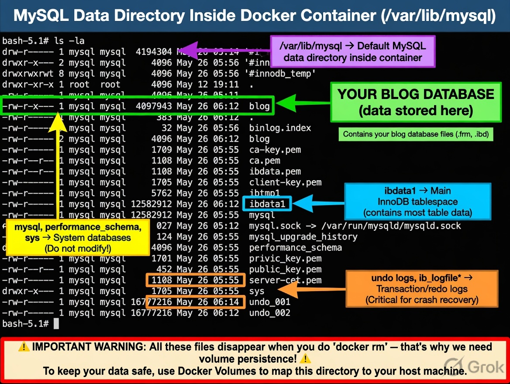
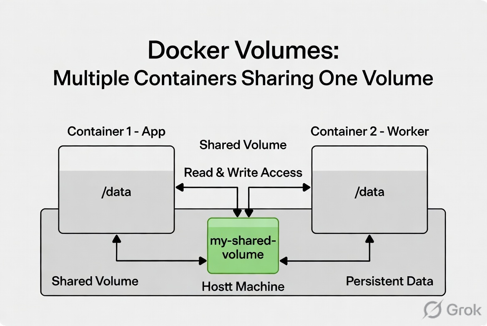

# Docker MySQL Persistence Notes

## Run a MySQL container

Run the official MySQL image in detached mode and set the root password.

```bash
docker run --name mydb -d -e MYSQL_ROOT_PASSWORD=root mysql
```

> If you use `--rm`, Docker removes the container when it stops. The named volume can still persist data, but the container itself is deleted.

## Access the MySQL client

```bash
docker exec -it mydb mysql -u root -p
```

## Open a shell inside the container

```bash
docker exec -it mydb bash
```

## Data persistence with stop/start

Stopping and starting the same container preserves the data stored inside that container's filesystem.

```bash
docker stop mydb
docker start mydb
```

- `docker stop` shuts down the container without deleting it.
- `docker start` restarts the same container with the same filesystem.
- Data remains available after stop/start because the container still exists.



## Data loss when removing the container

If the container is removed, its writable filesystem is deleted. Recreating a container without a volume starts from a clean state.

```bash
docker rm mydb
docker run --name mydb -d -e MYSQL_ROOT_PASSWORD=root mysql
```

- The old container’s data is lost when `docker rm` is used.
- A new container will not have the previous database files unless a volume is attached.

## Solution: use a Docker volume

Use a named Docker volume to persist MySQL data outside the container.

```bash
docker volume create my-db-vol
```

Run MySQL with the volume mounted to `/var/lib/mysql`:

```bash
docker run -d --name mydb \
  -e MYSQL_ROOT_PASSWORD=root \
  -v my-db-vol:/var/lib/mysql \
  mysql
```

- `-v my-db-vol:/var/lib/mysql` stores MySQL data in the named volume.
- MySQL uses `/var/lib/mysql` for its database files.
- The named volume remains even if the container is removed.



## Notes

- Named volumes are managed by Docker and stored on the host system.
- Reusing the same volume in a new container preserves the database data.
- Avoid `--rm` if you want to keep the container around for debugging. Use it only for temporary containers.
