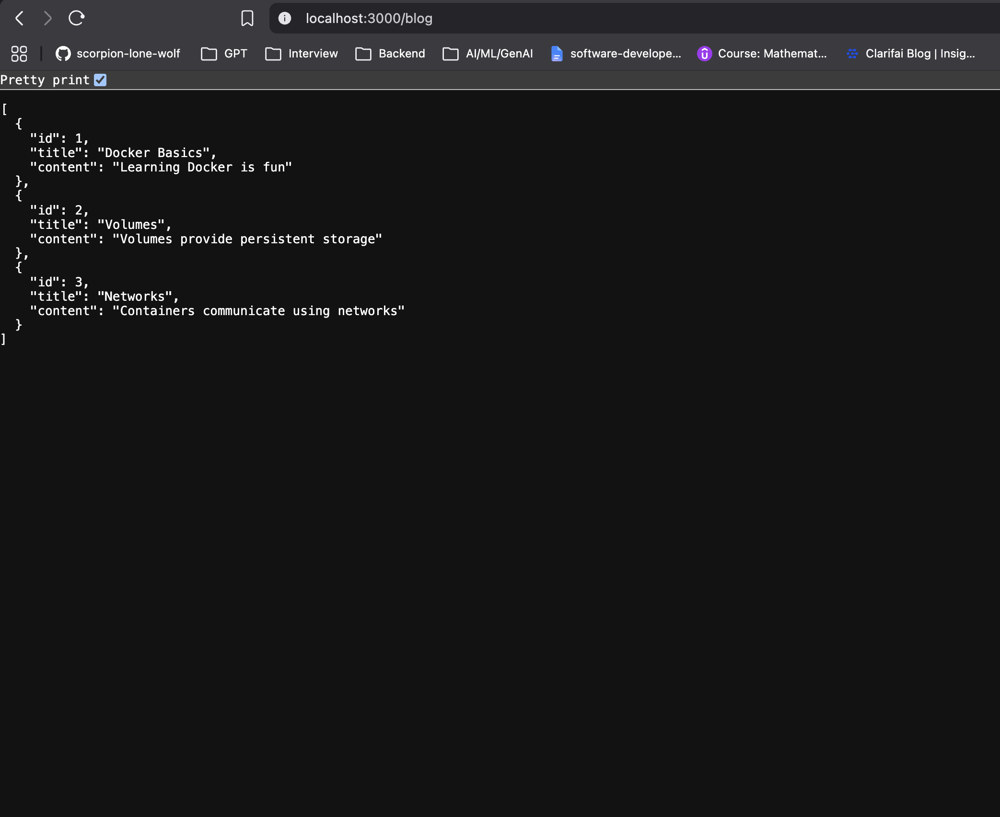

# Express + MySQL Docker Setup

This guide shows how to run an Express app and a MySQL container together using Docker, a custom bridge network, and a named volume for database persistence.

## 1. Create a custom Docker bridge network

Use a bridge network so both containers can communicate by name.

```bash
docker network create --driver bridge my-blog-net
```

## 2. Run MySQL container on the network

Start MySQL with a named volume mounted to `/var/lib/mysql` so data persists after container recreation.

```bash
docker run -d --rm \
  --name my-db \
  -e MYSQL_ROOT_PASSWORD=root \
  -v my-db-vol:/var/lib/mysql \
  --network my-blog-net \
  mysql
```

- `--name my-db` gives the container a predictable name.
- `-e MYSQL_ROOT_PASSWORD=root` sets the root password.
- `-v my-db-vol:/var/lib/mysql` stores MySQL data in a Docker volume.
- `--network my-blog-net` connects the container to the custom network.

## 3. Build the Express app image

Build the Docker image for the Express application from the current folder.

```bash
docker build -t my-app .
```

- `-t my-app` tags the image as `my-app`.
- `.` tells Docker to use the current directory and the `DockerFile` in it.

## 4. Seed the MySQL database

Run a temporary container on the same network to execute the seed script.

```bash
docker run --rm \
  --name seed-db \
  --network my-blog-net \
  my-app node seed.js
```

- `--rm` removes the container after the seed script exits.
- `node seed.js` runs the seed script inside the image.
- The container uses the same network so it can reach `my-db` by hostname.

## 5. Run the Express application container

Start the app container and publish port `3000` to the host.

```bash
docker run -d --rm \
  --name my-blog-app \
  --network my-blog-net \
  -p 3000:3000 \
  my-app
```

- `-p 3000:3000` maps host port `3000` to container port `3000`.
- `my-app` is the image built in step 3.

## Result

The Express app should now be able to connect to the MySQL database over the `my-blog-net` network.


