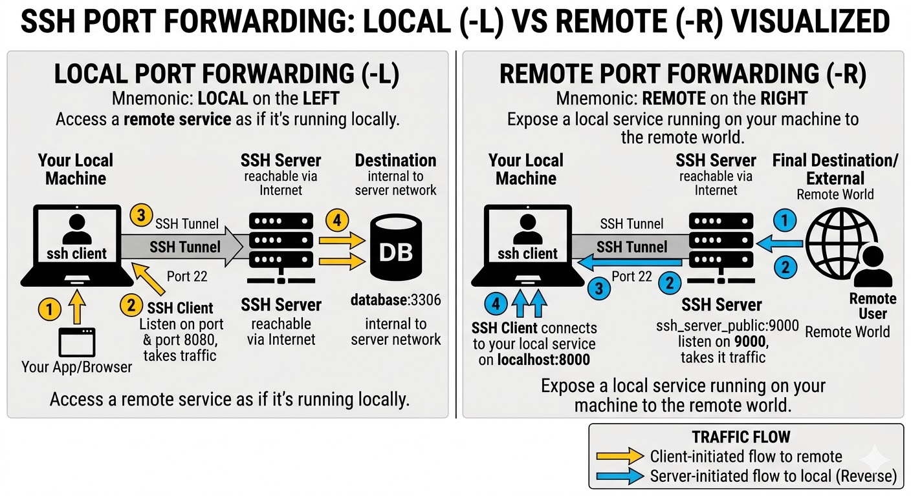

# SSH Tunneling & Port Forwarding

## What is SSH Tunneling?

SSH Tunneling allows secure forwarding of network traffic from one computer to another over an **encrypted SSH connection**.

---

## Use Case — Sharing a Local App with a Client

Consider the following scenario:

1. You are building an application **running locally** on your machine.
2. Your client wants to review the progress and access it over the internet.
3. Instead of deploying the app, you spin up a server on the cloud (e.g., AWS EC2) and set up **port forwarding**.
4. Any request that hits the AWS server is **forwarded to your local machine**.
5. The client can now access your locally running application through the cloud server's public address.

> In short: your local machine is the actual server, but the client reaches it via AWS as a relay — all traffic tunnelled securely over SSH.

---

## How It Works (Diagram)

```
Client (Browser)
      |
      |  HTTP request
      ▼
AWS EC2 Server (Public IP)
      |
      |  SSH Tunnel (encrypted)
      ▼
Your Local Machine (localhost:PORT)
      |
      ▼
Running Application
```

---

## Types of SSH Port Forwarding

| Type                   | Direction                    | Use Case                                                         |
| ---------------------- | ---------------------------- | ---------------------------------------------------------------- |
| **Local Forwarding**   | Local → Remote               | Access a remote service as if it were local                      |
| **Remote Forwarding**  | Remote → Local               | Expose a local service to the outside world (the use case above) |
| **Dynamic Forwarding** | Local → Remote (SOCKS proxy) | Route multiple ports through a single SSH tunnel                 |

---



---

## ⭐️ Remote Port Forwarding Command

This is the command used for the use case above — exposing your local app via a remote AWS server:

Example : ngrok creates a remote forward tunnel from their public servers to your local machine

```bash
ssh -i /path/to/your-key.pem \
  -R <remote_port>:localhost:<local_port> \
  ec2-user@ec2-xx-xx-xx-xx.compute-1.amazonaws.com
```

**Example** — forward traffic from AWS port `8080` to your local port `3000`:

```bash
ssh -i /path/to/your-key.pem \
  -R 8080:localhost:3000 \
  ec2-user@ec2-xx-xx-xx-xx.compute-1.amazonaws.com
```

Now any request to `http://ec2-xx-xx-xx-xx.compute-1.amazonaws.com:8080` will be tunnelled to `localhost:3000` on your machine.

---

## Key Flags

| Flag | Description                                                                                   |
| ---- | --------------------------------------------------------------------------------------------- |
| `-R` | Remote forwarding — binds a port on the **remote** server to a port on your **local** machine |
| `-L` | Local forwarding — binds a port on your **local** machine to a port on the **remote** server  |
| `-N` | Do not execute a remote command (useful when you only want the tunnel, no shell)              |
| `-f` | Run SSH in the background                                                                     |
| `-i` | Specify the private key for authentication                                                    |

---

## Important Note

For remote port forwarding to be accessible publicly (not just on the server itself), you need to enable `GatewayPorts` on the AWS server:

```bash
# On the EC2 server, edit /etc/ssh/sshd_config and add:
AllowTcpForwarding yes
GatewayPorts yes

# Then restart SSH
sudo systemctl restart sshd
```

---

# ⭐️ Local Port Forwarding Command

## What is Local Port Forwarding?

Local Port Forwarding lets you **bind a port on your local machine** and tunnel all traffic through an SSH connection to a port on a remote server (or a third machine reachable by that server).

## Command Syntax

```bash
ssh -i /path/to/your-key.pem \
  -L <local_port>:<target_host>:<target_port> \
  ec2-user@ec2-xx-xx-xx-xx.compute-1.amazonaws.com
```

Example :

```bash
ssh -L 8080:localhost:9090 user@remote-server
```

8080 (Local Port): The port YOUR computer opens and listens on.

localhost (Destination Host): Evaluated from the server's perspective (meaning the remote server itself not your local computer).

9090 (Destination Port): The port on the remote server where the traffic is dropped off.
