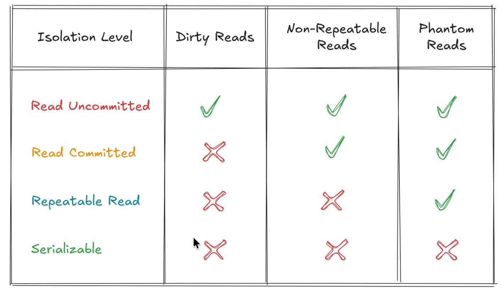

# Transaction Anomalies in Databases

Transaction anomalies are problems that can occur when multiple transactions run concurrently in a database without proper isolation.

These anomalies can lead to inconsistent or unexpected results. The most common transaction anomalies are:

- **Dirty Read**
- **Non-Repeatable Read**
- **Phantom Read**

---

## 1. Dirty Read

**Definition:**
A **Dirty Read** occurs when one transaction reads data that has been modified by another transaction, but that transaction has **not yet been committed**. If the first transaction is rolled back, the second transaction ends up reading data that never actually existed in the database.

**Example:**

- Transaction A updates a user's balance to ₹10,000 (but not committed yet).
- Transaction B reads the balance as ₹10,000.
- Transaction A gets rolled back (balance reverts to ₹5,000).
- Transaction B now has incorrect (dirty) data.

**Problem:** Reading uncommitted (dirty) data.

---

## 2. Non-Repeatable Read

**Definition:**
A **Non-Repeatable Read** occurs when a transaction reads the same row twice and gets different values because another transaction has updated and committed the data in between the two reads.

**Example:**

- Transaction A reads User 1's balance → ₹7,000.
- Transaction B updates User 1's balance to ₹9,000 and commits.
- Transaction A reads User 1's balance again → ₹9,000.

The same query returned different results within the same transaction.

**Also known as:** Inconsistent Analysis.

---

## 3. Phantom Read

**Definition:**
A **Phantom Read** occurs when a transaction executes the same query twice, and the number of rows returned changes because another transaction inserted or deleted rows that match the query condition.

**Example:**

- Transaction A runs `SELECT * FROM orders WHERE amount > 5000;` → Returns 5 rows.
- Transaction B inserts 2 new orders with amount > 5000 and commits.
- Transaction A runs the same query again → Now returns 7 rows.

New "phantom" rows appeared between the reads.

---

## Summary Table

| Anomaly                 | Description                                | What Changes            | Common Solution             |
| ----------------------- | ------------------------------------------ | ----------------------- | --------------------------- |
| **Dirty Read**          | Reads uncommitted data                     | Data value              | `READ COMMITTED` isolation  |
| **Non-Repeatable Read** | Same row gives different values            | Data value              | `REPEATABLE READ` isolation |
| **Phantom Read**        | Different number of rows in repeated query | Row count / Set of rows | `SERIALIZABLE` isolation    |

## 

**Tip:**
These anomalies are controlled by **Transaction Isolation Levels** in SQL databases (MySQL, PostgreSQL, SQL Server, etc.). Higher isolation levels reduce anomalies but may impact performance due to increased locking.
