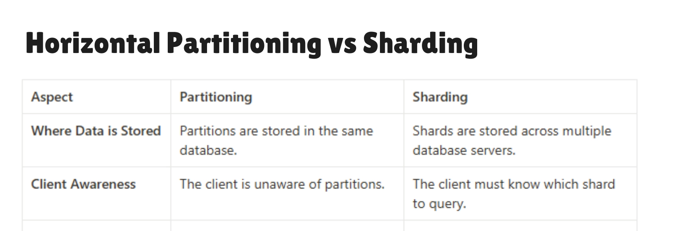

# Partitioning and Sharding

## Problem Statement

When our queries become slow despite having enough storage, it may be because our data has grown so large that even indexed queries take longer than usual. In this scenario, we can use either **Partitioning** or **Sharding** to improve performance.

---

## Partitioning

In partitioning, we divide a single large table into multiple smaller ones using a **partition key**. All the smaller tables (partitions) are generally stored within the **same database**. The partition key is used to determine which partition to look into for a given query.

### Types of Partitioning

- **Horizontal Partitioning (most commonly used)**
  - We break the large table into multiple smaller tables, where each table contains a subset of the rows but **all the columns** for those rows.

- **Vertical Partitioning**
  - We split the columns of a table across multiple tables. For example, one table might hold frequently accessed columns, while another holds the remaining (often less frequently used) columns.

### Choosing a Partition Key

- **Range-Based Partitioning**
  - Useful when we have numeric or date-based data. Data is partitioned based on ranges of the partition key (e.g., orders by month or year).

- **List-Based Partitioning**
  - Useful when the data can be grouped into distinct categories. For example, partitioning based on payment providers like `stripe`, `paypal`, `paysight`.

- **Hash-Based Partitioning**
  - Useful when there is an irregular distribution of data (e.g., Stripe has many records while Paysight has very few). We apply a hash function to the partition key (often a UUID or ID) and use modulo with the number of desired partitions to evenly distribute the data.

---

## Sharding

With sharding, instead of storing all data in one database, we create **multiple databases** called **shards** and distribute portions of the data across each shard. Each shard has the **same table structure**, but based on a **shard key**, our application determines which shard holds the relevant data.

Unlike partitioning, where all partitions typically reside in the same database, shards are distributed across **multiple servers** (or instances). This makes sharding a form of **horizontal scaling**, while partitioning is generally a single-server optimization.

---

## Key Differences

| Feature         | Partitioning                       | Sharding                                |
| --------------- | ---------------------------------- | --------------------------------------- |
| Location        | Same database/server               | Multiple databases/servers              |
| Management      | Handled by the DBMS                | Handled by the application layer        |
| Scaling Type    | Primarily performance optimization | Horizontal scaling                      |
| Complexity      | Lower                              | Higher (requires routing logic)         |
| Fault Isolation | Limited (single server)            | Better (failures affect only one shard) |
