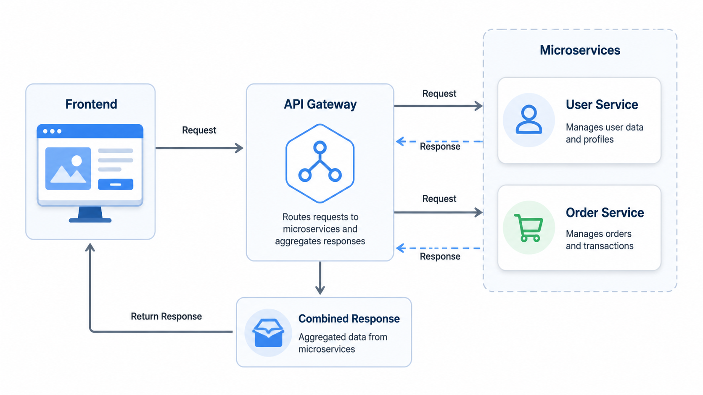

# JSON-RPC Manual Implementation

This project demonstrates a manual implementation of JSON-RPC in a microservices architecture using Node.js and Express.

## Architecture Overview

The project consists of four main components:

1. **Frontend** - A simple client that makes HTTP requests to the gateway
2. **Gateway** - An API gateway that orchestrates calls to multiple microservices
3. **User Service** - A microservice that manages user data
4. **Order Service** - A microservice that manages order data

## Architecture Diagram



## Data Flow

1. Frontend makes a request to Gateway: `GET /users/:id/details`
2. Gateway makes parallel JSON-RPC calls to:
   - User Service: `getUser({ id: userId })`
   - Order Service: `getUserByUserId({ userId })`
3. Gateway combines results and returns to Frontend
4. If Order Service fails, Gateway returns partial data (graceful degradation)

## Key Concepts Demonstrated

### API Orchestration

The process of combining multiple APIs into a single response. The Gateway calls both User and Order services, combines their results, and sends a unified response to the frontend.

### Partial Failure Handling

In microservices, some services might fail due to network issues. Instead of failing the entire request, the Gateway can return partial data with a warning.

### Graceful Degradation

When the Order Service is unavailable, the Gateway returns:

```json
{
  "user": {
    "id": 1,
    "name": "John"
  },
  "orders": [],
  "warning": "Order service unavailable"
}
```

### Fanout Pattern

One request triggers multiple concurrent service calls. All services are called simultaneously using `Promise.all()` for better performance.

## Services

### User Service (Port 4001)

- Endpoint: `POST /rpc`
- Methods:
  - `getAllUser()` - Returns all users
  - `getUser({ id })` - Returns user by ID

### Order Service (Port 4002)

- Endpoint: `POST /rpc`
- Methods:
  - `getUserByUserId({ userId })` - Returns orders for a user
- Includes a 5-second delay to simulate slow service

### Gateway (Port 4000)

- Endpoint: `GET /users/:id/details`
- Orchestrates calls to User and Order services
- Handles errors gracefully

## Running the Project

1. Start User Service:

   ```bash
   cd user-service
   npm install
   npm start
   ```

2. Start Order Service:

   ```bash
   cd order-service
   npm install
   npm start
   ```

3. Start Gateway:

   ```bash
   cd gateway
   npm install
   npm start
   ```

4. Start Frontend:

   ```bash
   cd frontend
   npm install
   npm start
   ```

5. Test the API:
   - Visit `http://localhost:3000` (frontend)
   - Or call `GET http://localhost:4000/users/1/details` directly

## JSON-RPC Format

All RPC calls use the JSON-RPC 2.0 specification:

**Request:**

```json
{
  "jsonrpc": "2.0",
  "method": "getUser",
  "params": { "id": 1 },
  "id": 123456789
}
```

**Response:**

```json
{
  "jsonrpc": "2.0",
  "result": { "id": 1, "name": "John" },
  "id": 123456789
}
```

## Benefits of This Architecture

- **Scalability**: Services can be scaled independently
- **Fault Tolerance**: Partial failures don't break the entire system
- **Maintainability**: Each service has a single responsibility
- **Technology Flexibility**: Services can use different tech stacks
